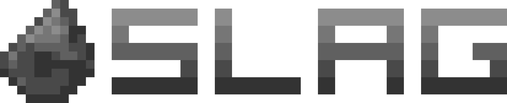

  

# SLAG (Rust version)
SLAG is a bot for the Discord chat service. It was created for small guilds such as school clubs.

SLAG is an initialism of "Security, Logging, Analytics and General Purpose". The logo is based off from this, with the goal of the bot to be "solid as steel". 

Unlike many other bots, there are no donations, premium or voting.

## Requirements
TBD

### Hardware
As specified in .cargo/config.toml, the target CPU is "sandybridge". This is to ensure support for the [hardware that I use for hosting SLAG](https://ctcl-tech.com/projects/srv_amp/). 

### Dependencies
TBD

## Legal
This project is licensed under the MIT Licesnse. See LICENSE for the full text.

All product names, logos, brands, trademarks and registered trademarks are property of their respective owners. All company, product and service names used are for identification purposes only. Use of these names, trademarks and brands does not imply endorsement.

## Privacy
Instances of the bot hosted by CTCL (myself) follow the privacy policy [here](https://ctcl-tech.com/privacy/).

The bot itself does not attempt to send any data to any external server. All data collected by the bot stays on the host.
